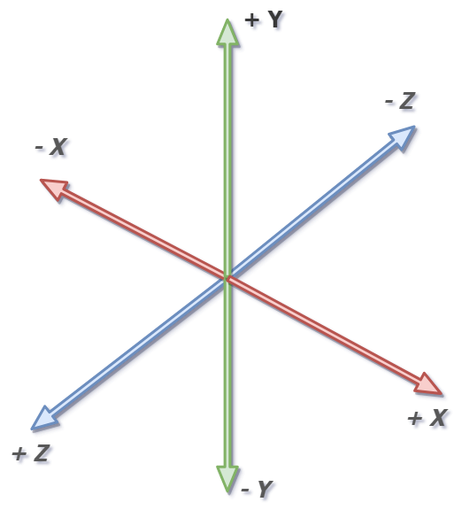
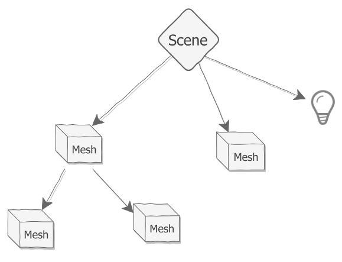
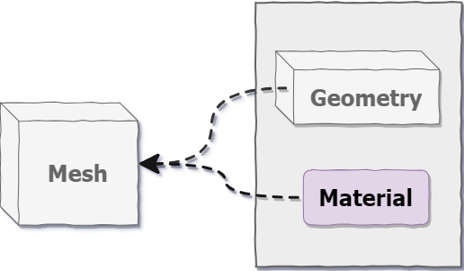

### 引言

随着WebGL技术的发展，浏览器中的3D渲染变得越来越普及。Three.js作为一个广受欢迎的JavaScript库，使得开发者可以轻松创建复杂的3D场景。本文将带你深入了解Three.js，帮助你掌握如何利用它打造丰富的Web 3D体验。

### Three.js概述

Three.js是一个基于WebGL的JavaScript库，旨在简化在网页上创建和渲染3D图形的过程。它封装了底层的WebGL API，使开发者可以使用更加简洁和直观的方式创建3D内容。


### 场景
场景是我们能看到的一切的载体。

```javascript
import { Scene } from 'three';

const scene = new Scene();
```


场景scene定义了一个名为**World Space（世界空间）**的坐标系，它是我们在 three.js 中处理可见对象时的主要参考框架。世界空间是一个 3D 笛卡尔坐标系。坐标系的详细情况这里暂不讨论。

场景的中心是点(0,0,0)，也称为坐标系的原点。每当我们创建一个新对象并将其添加到我们的场景中时，它将被放置在原点，并且每当我们移动它时，我们说的都是在这个坐标系中移动它。


当我们将对象添加到场景中时，它们会被放入 场景图中，这是一个树形结构，场景位于顶部。

 

这类似于 HTML 页面上元素的结构方式，不同之处在于 HTML 页面是 2D 而场景图是 3D。

### 相机
场景是指纯数学的领域。要查看场景，我们需要打开一个进入这个领域的窗口，并将其转换为对我们人眼感觉合理的东西，这就是相机的用武之地。有几种方法可以将场景图形转换为人类视觉友好的格式，使用称为投影的技术。对我们来说，最重要的投影类型是透视投影，它旨在匹配我们的眼睛看待世界的方式。要使用透视投影查看场景，我们使用 PerspectiveCamera。 这种类型的相机是现实世界中相机的 3D 等效物，并使用许多相同的概念和术语，例如视野和纵横比。与场景Scene不同的是，PerspectiveCamera构造函数有几个参数，我们将在下面详细解释。
```javascript
import { PerspectiveCamera } from 'three';

const fov = 35; // 摄像机视锥体垂直视野角度
const aspect = container.clientWidth / container.clientHeight; //摄像机视锥体长宽比
const near = 0.1; // 摄像机视锥体近端面
const far = 100; // 摄像机视锥体远端面

const camera = new PerspectiveCamera(fov, aspect, near, far);
```
另一种重要的投影类型是正交投影，我们使用 OrthographicCamera，这种类型的相机用于渲染 2D 图形或不需要透视效果的场景。具体来说：
透视投影：适合需要展示真实感和深度的场景，模拟人类视觉。
正交投影：适合技术绘图和需要精确测量的场景，物体无论距离远近均保持相同大小。

### 渲染器
如果场景是一个小宇宙，而相机是一个指向那个宇宙的望远镜，那么渲染器就是一个艺术家，他通过望远镜观察并将他们看到的东西非常快的绘制到一个canvas中去。 我们把这个过程叫做渲染，得到的图片就是一个渲染效果图。渲染器负责将场景和相机组合在一起，并将结果渲染到屏幕上。Three.js提供了多种渲染器，其中最常用的是WebGLRenderer。它使用WebGL API将场景和相机渲染到网页上。
```javascript
import { WebGLRenderer } from 'three';

const renderer = new WebGLRenderer();
```

### 网格
场景、相机和渲染器一起为我们提供了 three.js 应用程序的基本脚手架。但是，一个都看不到。所以还需要一种称为网格的可见对象。网格是 3D 计算机图形学中最常见的可见对象，用于显示各种 3D 对象——猫、狗、人类、树木、建筑物、花卉和山脉都可以使用网格来表示。还有其他种类的可见对象，例如线条、形状、精灵和粒子等。

```javascript
import { Mesh } from 'three';

const cube = new Mesh(geometry, material);
```
Mesh构造函数有两个参数：几何和材质。在创建网格之前，我们需要创建这两个。

### 几何体
几何体定义了网格的形状。Three.js 提供了几种内置几何体，例如立方体、球体、圆柱体、平面和圆环等。我们还可以使用自定义几何体，通过定义顶点、面和法线等属性来创建复杂的形状。
```javascript
import { BoxGeometry } from 'three';

const geometry = new BoxGeometry(1, 1, 1);
```
构造函数最多需要六个参数，但在这里，我们只提供前三个参数，它们指定盒子的长度、宽度和深度。默认值将被提供给我们省略的任何其他参数。您可以在下面的场景中使用所有六个参数。
### 材质
材质决定了网格的外观。Three.js 提供了几种内置材质，例如基础材质、 Lambert 材质和 Phong 材质等。我们还可以使用自定义材质，通过定义颜色、纹理和光照等属性来创建复杂的材质。
```javascript
import { MeshBasicMaterial } from 'three';

const material = new MeshBasicMaterial({ color: 0x00ff00 });
```
### 动画
Three.js 提供了多种动画方式，包括使用requestAnimationFrame函数进行帧动画，使用Tween.js库进行补间动画，以及使用Three.js的动画系统进行更复杂的动画控制。